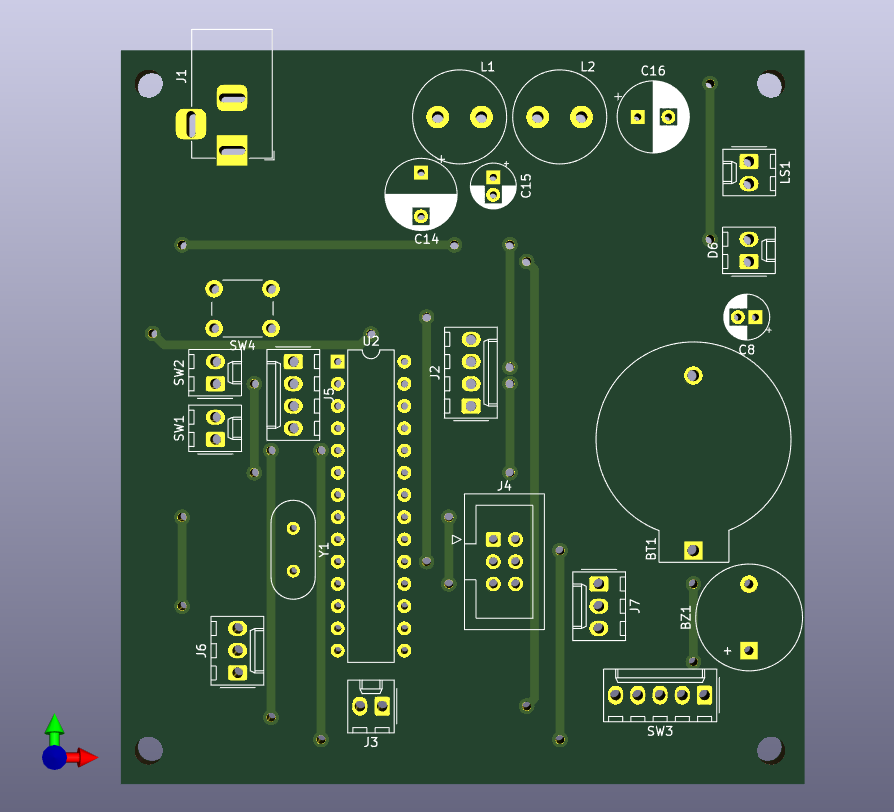

# AlarmClock Hardware
This repository contains hardware design files for [AlarmClock][AlarmClock].

Schematics and PCBs are designed in [KiCAD][KiCAD].

[AlarmClock]: https://github.com/ondras12345/AlarmClock
[KiCAD]: https://www.kicad.org/
